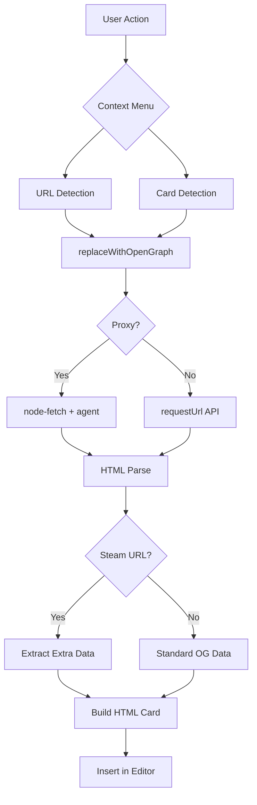

# Architect Mode - AGENTS.md

Architecture constraints and design patterns for the Open Graph Card plugin.

## Architecture Overview

## Design Constraints

### Single File Architecture
- Main plugin logic in [`main.ts`](main.ts) (~560 lines)
- Settings tab as inner class
- No separate service layers

### External Dependencies
- Must remain `isDesktopOnly: true` due to:
  - `electron` clipboard access
  - `node-fetch` for proxy support
  - File system operations

### Card Format
Cards are stored as HTML blocks in markdown with specific markers:
- Opening: `
`
- Closing: `<!--og-card-end-->\n
`
- User text end: `<!--og-user-text-end-->`

### Extension Points
1. **New metadata sources**: Add hostname detection in [`replaceWithOpenGraph()`](main.ts:311)
2. **New locales**: Add file to `i18n/` and import in [`index.ts`](i18n/index.ts)
3. **Card layouts**: Add CSS class and toggle in settings

## Performance Considerations
- Card parsing looks up to 100 lines up, 10 lines down, 200 lines forward
- Image downloads use `Promise.all()` for parallel processing
- No caching - each update re-fetches all data
