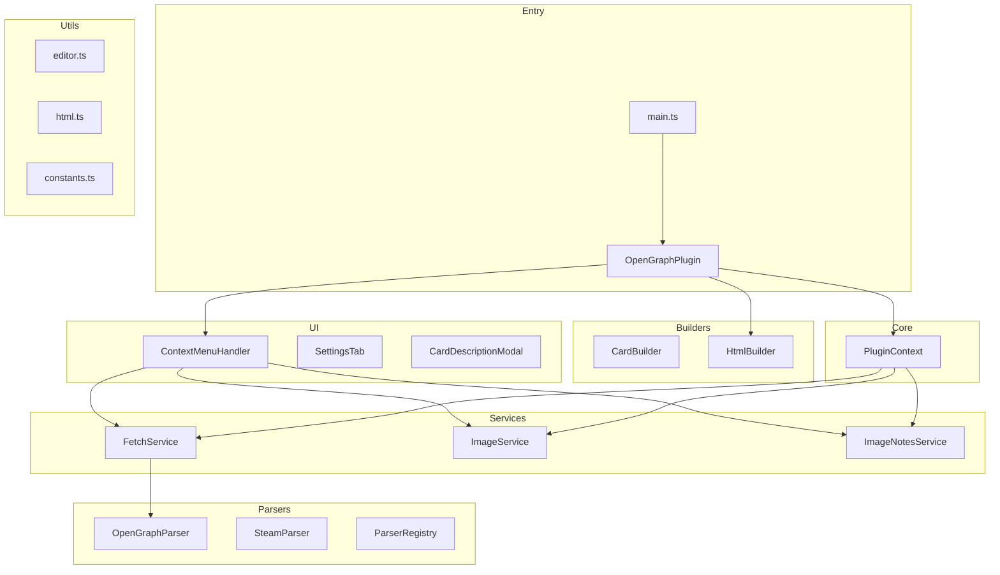

# Architect Mode - AGENTS.md

Architecture constraints and design patterns for the Open Graph Card plugin.

## Architecture Overview

## Design Constraints

### Modular Architecture
- Entry point in [`main.ts`](main.ts) - plugin registration and initialization
- Core logic organized in `src/` directory with clear separation of concerns
- Dependency Injection via [`PluginContext`](src/core/PluginContext.ts)

### External Dependencies
- Must remain `isDesktopOnly: true` due to:
  - `electron` clipboard access in [`ContextMenuHandler`](src/ui/ContextMenuHandler.ts)
  - `node-fetch` for proxy support
  - File system operations for image management

### Card Format
Cards are stored as HTML blocks in markdown with specific markers:
- Opening: `
`
- Closing: `<!--og-card-end {cardId}-->\n
`
- User text end: `<!--og-user-text-end-->`

### Extension Points
1. **New metadata sources**: Create parser extending [`OpenGraphParser`](src/parsers/OpenGraphParser.ts) and register via [`parserRegistry.registerParser()`](src/parsers/ParserRegistry.ts:41)
2. **New locales**: Add file to `i18n/` and import in [`index.ts`](i18n/index.ts)
3. **Card layouts**: Add CSS class and toggle in settings

## Key Modules

### PluginContext ([`src/core/PluginContext.ts`](src/core/PluginContext.ts))
Dependency Injection container that holds:
- `app: App` - Obsidian app instance
- `getSettings: () => OpenGraphSettings` - Settings accessor
- `fetchService: FetchService` - HTTP requests
- `imageService: ImageService` - Image operations
- `imageNotesService: ImageNotesService` - Image notes synchronization

### FetchService ([`src/services/FetchService.ts`](src/services/FetchService.ts))
- [`fetchHtml()`](src/services/FetchService.ts:44) - Fetch HTML content with optional proxy
- [`fetchBinary()`](src/services/FetchService.ts:80) - Fetch binary data (images)
- [`createAgent()`](src/services/FetchService.ts:17) - Creates proxy agent (HTTP/SOCKS5)

### ImageService ([`src/services/ImageService.ts`](src/services/ImageService.ts))
- [`downloadAndSave()`](src/services/ImageService.ts:23) - Download and save image to vault
- [`classifySources()`](src/services/ImageService.ts:49) - Classify image sources as local/url/mixed
- [`cleanupCardImages()`](src/services/ImageService.ts:99) - Delete local images when card is removed
- [`classifyCardImageSources()`](src/services/ImageService.ts:114) - Classify card images as URL/local
- [`downloadCardImages()`](src/services/ImageService.ts:141) - Download all remote images in card
- [`restoreCardImages()`](src/services/ImageService.ts:189) - Restore URLs from data-url attributes

### ImageNotesService ([`src/services/ImageNotesService.ts`](src/services/ImageNotesService.ts))
- [`syncNote()`](src/services/ImageNotesService.ts:30) - Synchronize note with card images
- [`deleteNote()`](src/services/ImageNotesService.ts:64) - Delete card's note
- [`getNotePath()`](src/services/ImageNotesService.ts:83) - Get note path by card ID

### ParserRegistry ([`src/parsers/ParserRegistry.ts`](src/parsers/ParserRegistry.ts))
- [`getParser(url)`](src/parsers/ParserRegistry.ts:16) - Returns appropriate parser for URL
- [`registerParser()`](src/parsers/ParserRegistry.ts:41) - Add custom parser
- Singleton instance: [`parserRegistry`](src/parsers/ParserRegistry.ts:47)

## Architecture Patterns

### Card Boundary Detection
Cards use HTML comment markers for parsing: `<!--og-card-end-->` and `<!--og-user-text-end-->`. These markers are essential for the [`getCardUnderCursor()`](main.ts:49) function to locate card boundaries in markdown.

### Card ID System
Each card has a unique `card-id` attribute (timestamp-based). The end marker includes the ID: `<!--og-card-end {cardId}-->`. This prevents mismatched card boundaries when multiple cards exist.

### Live Preview Integration
Uses CodeMirror's `posAtDOM()` method to map DOM elements back to editor positions. See [`lastContextEventTarget`](src/ui/ContextMenuHandler.ts:28) pattern for context menu handling.

### Proxy Architecture
Dual proxy support via `https-proxy-agent` (HTTP) and `socks-proxy-agent` (SOCKS5). Proxy URL prefix determines agent type. See [`createAgent()`](src/services/FetchService.ts:17).

### CSS Classes
All CSS classes are centralized in [`src/utils/constants.ts`](src/utils/constants.ts):
- `CSS_CLASSES` - Card structure classes (og-card, og-image, og-content, etc.)
- `STEAM_RATING_CLASSES` - Rating display classes (steamdb_rating_good, etc.)

### Card Bounds Constants
Defined in [`CARD_BOUNDS`](src/utils/constants.ts:24):
- `LOOK_UP_LINES: 10` - Lines to search upward for card start
- `LOOK_DOWN_LINES: 10` - Lines to search downward for card start
- `LOOK_FORWARD_LINES: 20` - Lines to search forward for card end

### Image Notes Sync Pattern
Each card with local images has a corresponding note file with markdown links:
- Notes stored in `{attachmentFolderPath}/open-graph-card/{card-id}.md`
- [`ImageNotesService`](src/services/ImageNotesService.ts) maintains sync between card content and note file
- Note created when card has local images
- Note updated when images are added/removed
- Note deleted when card is deleted or has no local images
- Provides Obsidian-native access to card images via note links

## Performance Considerations
- Card parsing looks up to 10 lines up, 10 lines down, 20 lines forward
- Image downloads use `Promise.all()` for parallel processing
- No caching - each update re-fetches all data
