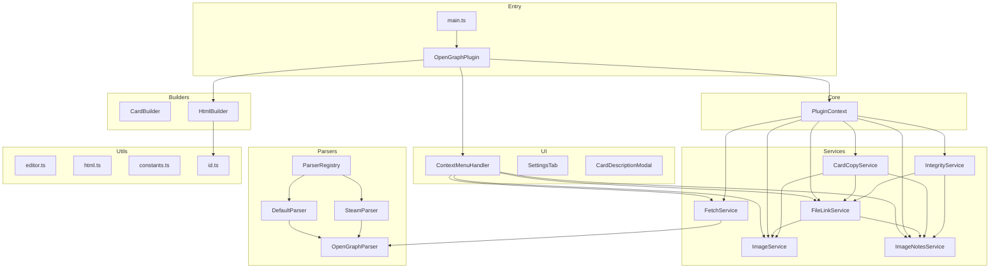

# AGENTS.md

This file provides guidance to agents when working with code in this repository.

## Build Commands
- Build: `npm run build` (uses esbuild with `--platform=node --external:obsidian --external:electron --format=cjs`)
- No lint or test commands configured

## Architecture Overview



## Project Structure

```
src/
├── types/              # TypeScript interfaces and types
│   ├── index.ts        # Re-exports all types
│   ├── settings.ts     # OpenGraphSettings, DEFAULT_SETTINGS
│   ├── card.ts         # CardData, CardInfo, UrlInfo, RatingData, ScreenshotData
│   ├── image.ts        # ImageSourceClassification, ImageDataUrlInfo, ImageDownloadResult, ImageRestoreResult, ImageData
│   ├── fileLinks.ts    # CardLinks, FileLinkIndexes, FileLinksData, FileLinkInfo, FileDeletedEventData, FileRenamedEventData, UserNoteEventData
│   └── ui.ts           # ContextMenuHandlerCallbacks
│
├── core/
│   └── PluginContext.ts    # Dependency Injection container
│
├── services/
│   ├── FetchService.ts     # HTTP requests via Obsidian API
│   ├── FileLinkService.ts  # File links tracking and events
│   ├── ImageService.ts     # Image download, classification, cleanup
│   ├── ImageNotesService.ts # Image notes synchronization
│   ├── CardCopyService.ts  # Card copy detection and handling
│   └── IntegrityService.ts # Integrity check on startup
│
├── parsers/
│   ├── OpenGraphParser.ts  # Abstract base parser
│   ├── DefaultParser.ts    # Default parser for regular sites
│   ├── SteamParser.ts      # Steam-specific parser
│   └── ParserRegistry.ts   # Parser selection by hostname
│
├── builders/
│   ├── CardBuilder.ts      # CardData builder pattern
│   └── HtmlBuilder.ts      # HTML markup generation
│
├── ui/
│   ├── ContextMenuHandler.ts   # Context menu logic
│   ├── SettingsTab.ts          # Settings UI
│   └── modals/
│       └── CardDescriptionModal.ts
│
└── utils/
    ├── constants.ts       # CSS_CLASSES, STEAM_RATING_CLASSES, CARD_BOUNDS
    ├── editor.ts          # getUrlUnderCursor, setCursorWithScrollPrevention
    ├── html.ts            # escapeHTML, extractCardId, extractUrl, extractUserText, getImageDataUrlsFromCard, replaceImageInCard
    └── id.ts              # generateCardId - unique card ID generator
```

## Key Modules

### PluginContext ([`src/core/PluginContext.ts`](src/core/PluginContext.ts))
Dependency Injection container that holds:
- `app: App` - Obsidian app instance
- `getSettings: () => OpenGraphSettings` - Settings accessor
- `fetchService: FetchService` - HTTP requests
- `fileLinkService: FileLinkService` - File links tracking and events
- `imageService: ImageService` - Image operations
- `imageNotesService: ImageNotesService` - Image notes synchronization
- `cardCopyService: CardCopyService` - Card copy detection and handling
- `integrityService: IntegrityService` - Integrity check on startup

### FetchService ([`src/services/FetchService.ts`](src/services/FetchService.ts))
- [`fetchHtml()`](src/services/FetchService.ts:13) - Fetch HTML content via Obsidian API
- [`fetchBinary()`](src/services/FetchService.ts:29) - Fetch binary data (images) via Obsidian API

### FileLinkService ([`src/services/FileLinkService.ts`](src/services/FileLinkService.ts))
- [`registerCard()`](src/services/FileLinkService.ts:75) — Register card with user note paths (string or string[])
- [`setGeneratedNote()`](src/services/FileLinkService.ts:107) — Set generated note path
- [`clearGeneratedNote()`](src/services/FileLinkService.ts:132) — Clear generated note path
- [`addUserNote()`](src/services/FileLinkService.ts:158) — Add user note path to existing card
- [`removeUserNote()`](src/services/FileLinkService.ts:193) — Remove user note path from card
- [`hasUserNotes()`](src/services/FileLinkService.ts:237) — Check if card has user notes
- [`getUserNotePaths()`](src/services/FileLinkService.ts:245) — Get all user note paths for card
- [`addImage()`](src/services/FileLinkService.ts:253) — Add image to card links
- [`removeImage()`](src/services/FileLinkService.ts:271) — Remove image from card links
- [`unregisterCard()`](src/services/FileLinkService.ts:289) — Remove card and all links
- [`findFileLink()`](src/services/FileLinkService.ts:329) — Find card by file path
- [`getAllCardIds()`](src/services/FileLinkService.ts:392) — Get all registered card IDs
- [`handleFileDelete()`](src/services/FileLinkService.ts:445) — Handle file deletion events
- [`handleFileRename()`](src/services/FileLinkService.ts) — Handle file rename events

### ImageService ([`src/services/ImageService.ts`](src/services/ImageService.ts))
- [`downloadAndSave()`](src/services/ImageService.ts:23) - Download and save image to vault
- [`classifySources()`](src/services/ImageService.ts:49) - Classify image sources as local/url/mixed
- [`cleanupCardImages()`](src/services/ImageService.ts:99) - Delete local images when card is removed
- [`classifyCardImageSources()`](src/services/ImageService.ts:114) - Classify card images as URL/local
- [`downloadCardImages()`](src/services/ImageService.ts:141) - Download all remote images in card
- [`restoreCardImages()`](src/services/ImageService.ts:189) - Restore URLs from data-url attributes

### ImageNotesService ([`src/services/ImageNotesService.ts`](src/services/ImageNotesService.ts))
- [`syncNote()`](src/services/ImageNotesService.ts:30) - Synchronize note with card images
- [`deleteNote()`](src/services/ImageNotesService.ts:64) - Delete card's note
- [`getNotePath()`](src/services/ImageNotesService.ts:83) - Get note path by card ID

### CardCopyService ([`src/services/CardCopyService.ts`](src/services/CardCopyService.ts))
Service for detecting and handling card copying:
- [`initialize()`](src/services/CardCopyService.ts:53) - Initialize event listeners
- [`destroy()`](src/services/CardCopyService.ts:64) - Release resources
- [`suspendProcessing()`](src/services/CardCopyService.ts:81) - Suspend change processing
- [`resumeProcessing()`](src/services/CardCopyService.ts:88) - Resume change processing
- [`processCard()`](src/services/CardCopyService.ts:235) - Process detected card
- [`handleCardCopy()`](src/services/CardCopyService.ts:264) - Handle card copy (generate new ID, copy images)
- [`copyImage()`](src/services/CardCopyService.ts:354) - Copy image file for new card

Events listened: `editor-change`, `editor-paste`
Protection: Double-processing prevention via `processedChanges` Set

### IntegrityService ([`src/services/IntegrityService.ts`](src/services/IntegrityService.ts))
Service for checking links integrity on startup:
- [`scheduleCheck()`](src/services/IntegrityService.ts:39) - Schedule integrity check after 10 seconds
- [`checkIntegrity()`](src/services/IntegrityService.ts:55) - Main integrity check method
- [`fileExists()`](src/services/IntegrityService.ts:117) - Check if file exists in vault
- [`cleanupBrokenLinks()`](src/services/IntegrityService.ts:132) - Remove broken links

### OpenGraphParser ([`src/parsers/OpenGraphParser.ts`](src/parsers/OpenGraphParser.ts))
Abstract base class for all parsers:
- [`canParse()`](src/parsers/OpenGraphParser.ts:10) - Abstract method to check if parser can handle URL
- [`parse()`](src/parsers/OpenGraphParser.ts:15) - Abstract method to parse document
- [`extractBasicData()`](src/parsers/OpenGraphParser.ts:20) - Extract basic Open Graph metadata
- [`getHeaders()`](src/parsers/OpenGraphParser.ts:45) - Returns default HTTP headers

### DefaultParser ([`src/parsers/DefaultParser.ts`](src/parsers/DefaultParser.ts))
Default parser for regular websites, extends OpenGraphParser:
- [`canParse()`](src/parsers/DefaultParser.ts:8) - Returns `true` for all sites (fallback)
- [`parse()`](src/parsers/DefaultParser.ts:13) - Extracts basic Open Graph data

### ParserRegistry ([`src/parsers/ParserRegistry.ts`](src/parsers/ParserRegistry.ts))
- [`getParser()`](src/parsers/ParserRegistry.ts:17) - Returns appropriate parser for URL
- [`isSteamUrl()`](src/parsers/ParserRegistry.ts:30) - Check if URL is a Steam link
- [`registerParser()`](src/parsers/ParserRegistry.ts:42) - Add custom parser
- Singleton instance: [`parserRegistry`](src/parsers/ParserRegistry.ts:48)

### SteamParser ([`src/parsers/SteamParser.ts`](src/parsers/SteamParser.ts))
Extends OpenGraphParser for Steam-specific data:
- Uses `#appHubAppName` for title
- [`extractRating()`](src/parsers/SteamParser.ts:58) - SteamDB Bayesian formula
- [`extractTags()`](src/parsers/SteamParser.ts:103) - Up to 5 popular tags
- [`extractScreenshots()`](src/parsers/SteamParser.ts:114) - From data-props JSON

### HtmlBuilder ([`src/builders/HtmlBuilder.ts`](src/builders/HtmlBuilder.ts))
- [`buildCard()`](src/builders/HtmlBuilder.ts:27) - Generate complete card HTML
- [`buildImage()`](src/builders/HtmlBuilder.ts:37) - Image HTML with data-url attribute
- [`buildRating()`](src/builders/HtmlBuilder.ts:77) - Rating display with CSS class
- [`buildTags()`](src/builders/HtmlBuilder.ts:85) - Tags container
- [`buildScreenshots()`](src/builders/HtmlBuilder.ts:95) - Screenshots grid

### id.ts utilities ([`src/utils/id.ts`](src/utils/id.ts))
- [`generateCardId()`](src/utils/id.ts:10) - Generate unique card ID

### html.ts utilities ([`src/utils/html.ts`](src/utils/html.ts))
- [`escapeHTML()`](src/utils/html.ts:12) - Escape special HTML characters
- [`extractCardId()`](src/utils/html.ts:28) - Extract card-id from HTML
- [`extractUrl()`](src/utils/html.ts:38) - Extract URL from card HTML
- [`extractUserText()`](src/utils/html.ts:48) - Extract user text from card
- [`getImageSourcesFromCard()`](src/utils/html.ts:68) - Get all img src values
- [`getImageDataUrlsFromCard()`](src/utils/html.ts:89) - Get image data-url info array
- [`replaceImageInCard()`](src/utils/html.ts:123) - Replace image src by index

### ContextMenuHandler ([`src/ui/ContextMenuHandler.ts`](src/ui/ContextMenuHandler.ts))
- [`createHandler()`](src/ui/ContextMenuHandler.ts:40) - Create editor-menu event handler
- [`addCardMenuItems()`](src/ui/ContextMenuHandler.ts:74) - Add card context menu items
- [`addImageMenuItems()`](src/ui/ContextMenuHandler.ts:226) - Add image-related menu items
- [`handleDownloadImages()`](src/ui/ContextMenuHandler.ts:265) - Download images handler
- [`handleRestoreImages()`](src/ui/ContextMenuHandler.ts:306) - Restore image URLs handler

### Types: image.ts ([`src/types/image.ts`](src/types/image.ts))
- `ImageSourceClassification` - Classification result for image sources
- `ImageDataUrlInfo` - Image element data-url information
- `ImageDownloadResult` - Result of image download operation
- `ImageRestoreResult` - Result of image restore operation
- `ImageData` - Image data interface for card images

### Types: fileLinks.ts ([`src/types/fileLinks.ts`](src/types/fileLinks.ts))
- `CardLinks` - Card links structure with `userNotePaths: string[]`
- `FileLinkIndexes` - Reverse indexes for O(1) lookup
- `FileLinksData` - Data structure for persistence
- `FileLinkInfo` - Result of file link search
- `FileDeletedEventData` - Event data for file deletion
- `FileRenamedEventData` - Event data for file rename
- `UserNoteEventData` - Event data for user note changes

### Types: ui.ts ([`src/types/ui.ts`](src/types/ui.ts))
- `ContextMenuHandlerCallbacks` - Callback interface for ContextMenuHandler:
  - `getCardUnderCursor` - Get card info under cursor
  - `replaceWithOpenGraph` - Replace URL with Open Graph card
  - `updateCardUserText` - Update user text in card
  - `toggleCardOrientation` - Toggle card orientation

## Architecture Patterns

### Card Boundary Detection
Cards use HTML comment markers for parsing: `<!--og-card-end-->` and `<!--og-user-text-end-->`. These markers are essential for the [`getCardUnderCursor()`](main.ts:49) function to locate card boundaries in markdown.

### Card ID System
Each card has a unique `card-id` attribute. The end marker includes the ID: `<!--og-card-end {cardId}-->`. This prevents mismatched card boundaries when multiple cards exist.

### Card ID Generation
Card IDs are generated using [`generateCardId()`](src/utils/id.ts:10):
- Format: `og_{timestamp}_{random}`
- `timestamp`: milliseconds since epoch
- `random`: 8 random characters (a-z0-9)
- Uses `crypto.getRandomValues()` for cryptographically secure generation
- Example: `og_1710521234567_a3b5c7d9`

### Live Preview Integration
Uses CodeMirror's `posAtDOM()` method to map DOM elements back to editor positions. See [`lastContextEventTarget`](src/ui/ContextMenuHandler.ts:28) pattern for context menu handling.

### Steam-Specific Handling
- Detects Steam via `store.steampowered.com` hostname
- Uses `#appHubAppName` element for title (falls back to og:title)
- Rating uses SteamDB Bayesian formula: `score = average - (average - 0.5) * (2 ** -Math.log10(totalVotes + 1))`
- Screenshots parsed from JSON in `.gamehighlight_desktopcarousel` data-props attribute
- Cookie header `wants_mature_content=1` for 18+ content

### i18n Pattern
Uses `moment.locale()` for language detection. Translation keys use `{0}`, `{1}` placeholders substituted via [`t()`](i18n/index.ts:6) function.

### CSS Classes
All CSS classes are centralized in [`src/utils/constants.ts`](src/utils/constants.ts):
- `CSS_CLASSES` - Card structure classes (og-card, og-image, og-content, etc.)
- `STEAM_RATING_CLASSES` - Rating display classes (steamdb_rating_good, etc.)

### Card Bounds Constants
Defined in [`CARD_BOUNDS`](src/utils/constants.ts:24):
- `LOOK_UP_LINES: 10` - Lines to search upward for card start
- `LOOK_DOWN_LINES: 10` - Lines to search downward for card start
- `LOOK_FORWARD_LINES: 20` - Lines to search forward for card end

### Image Notes Sync
Each card with local images has a corresponding note file with markdown links.
Notes are stored in `{attachmentFolderPath}/open-graph-card/{card-id}.md`.
The [`ImageNotesService`](src/services/ImageNotesService.ts) maintains sync between card content and note file.
- Note created when card has local images
- Note updated when images are added/removed
- Note deleted when card is deleted or has no local images

## File Links Architecture

### Links Structure
Each card can have the following links:
- **User Notes ↔ Card** — Array of user's markdown files containing the card (`userNotePaths: string[]`)
- **Generated Note ↔ Card** — Auto-generated note with image links (named `{card-id}.md`)
- **Images ↔ Card** — Local image files downloaded from card

### Multiple User Notes Support
A single card can exist in multiple user notes simultaneously:
- When a card is copied to another note, a new entry is added to `userNotePaths`
- [`addUserNote()`](src/services/FileLinkService.ts:158) adds a new note path
- [`removeUserNote()`](src/services/FileLinkService.ts:193) removes a note path
- Card is only fully deleted when `userNotePaths` becomes empty

### Event Flow
1. **Card Created** → `registerCard(cardId, userNotePaths)`
2. **Images Downloaded** → `addImage(cardId, imagePath)` for each image
3. **Generated Note Created** → `setGeneratedNote(cardId, notePath)`
4. **Card Copied** → `addUserNote(cardId, newNotePath)` + new card-id generation + image copying

### File Deletion Handling
- **User Note Deleted** → `removeUserNote()`, if last note then delete generated note and images
- **Generated Note Deleted** → Delete all local images, remove all links
- **Image Deleted** → Update generated note, replace local path with URL in card

### Custom Events
- `og-card-created` — Card created in user note
- `og-card-images-downloaded` — Images downloaded to local storage
- `og-card-images-restored` — Images restored to remote URLs
- `og-card:user-note-added` — User note path added to card
- `og-card:user-note-removed` — User note path removed from card (more notes remain)
- `og-card:last-user-note-deleted` — Last user note path removed from card
- `og-card:generated-note-deleted` — Generated note file deleted
- `og-card:image-deleted` — Linked image file deleted
- `og-card:file-renamed` — Linked file renamed

## Card Copy Handling

### Copy Detection
[`CardCopyService`](src/services/CardCopyService.ts) monitors:
- `editor-change` event for duplicate/cut-paste operations
- `editor-paste` event for clipboard paste

### Copy Processing
When a card copy is detected:
1. Generate new unique card-id via [`generateCardId()`](src/utils/id.ts:10)
2. Replace card-id in HTML (attribute and end marker)
3. Copy all local images to new files
4. Update image paths in HTML
5. Register new card in [`FileLinkService`](src/services/FileLinkService.ts)
6. Sync image notes via [`ImageNotesService`](src/services/ImageNotesService.ts)

### Protection Mechanisms
- `processedChanges` Set prevents double-processing
- `processingSuspended` flag for temporary suspension during programmatic changes
- Memory cleanup for old change keys (max 100 entries)

## Integrity Check

### Startup Check
[`IntegrityService`](src/services/IntegrityService.ts) runs 10 seconds after plugin load:
1. Iterate all registered card IDs
2. Check existence of each linked file
3. Remove broken links from `CardLinks`
4. Unregister cards with no remaining user notes

### Broken Links Cleanup
- Missing user notes → removed from `userNotePaths` array
- Missing generated note → `clearGeneratedNote()`
- Missing images → removed from `imagePaths` Set

## Extension Points

### Adding a New Parser
1. Create a class extending [`OpenGraphParser`](src/parsers/OpenGraphParser.ts:6)
2. Implement `canParse(hostname: string): boolean`
3. Implement `parse(doc: Document, url: string): Promise<CardData>`
4. Register via [`parserRegistry.registerParser()`](src/parsers/ParserRegistry.ts:42)

### Adding New Card Features
1. Extend [`CardData`](src/types/card.ts) interface
2. Update [`CardBuilder`](src/builders/CardBuilder.ts) with new method
3. Update [`HtmlBuilder`](src/builders/HtmlBuilder.ts) to render new feature
4. Add CSS to `styles.css`

## Key Dependencies
- Obsidian API: `requestUrl()` for HTTP requests

## Desktop-Only Requirement
Plugin must remain `isDesktopOnly: true` due to:
- `electron` clipboard access in [`ContextMenuHandler`](src/ui/ContextMenuHandler.ts:184)
- File system operations for image management
