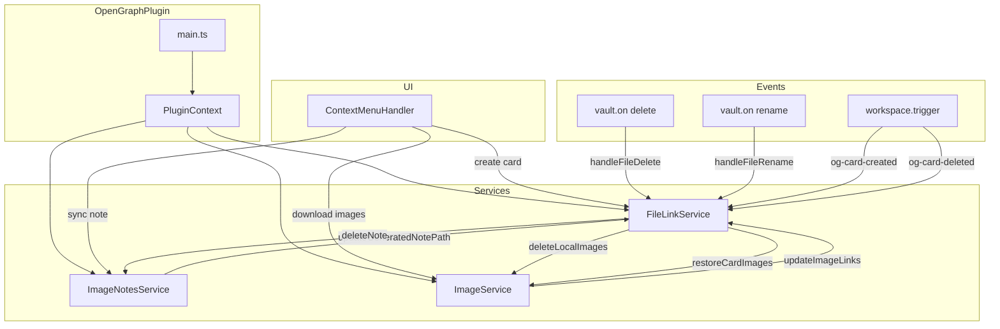
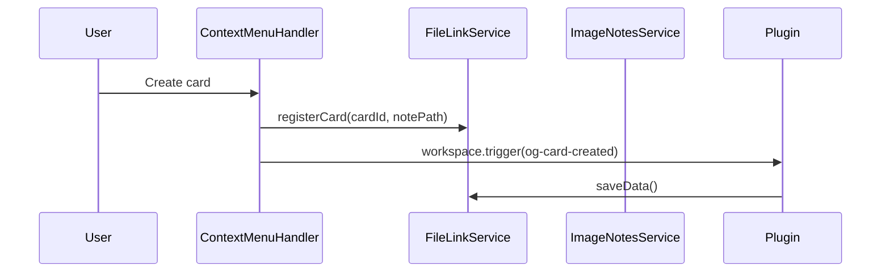
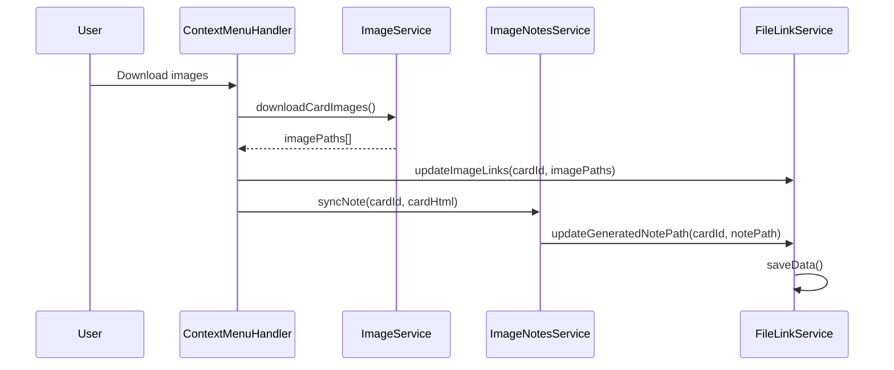
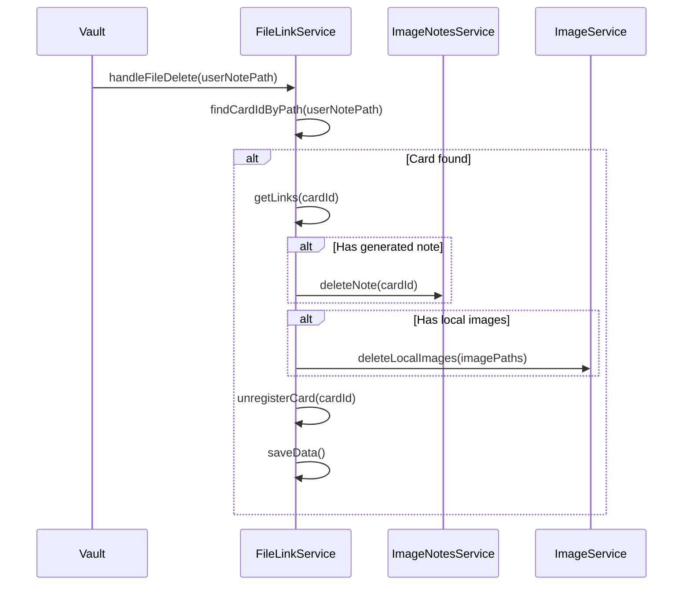
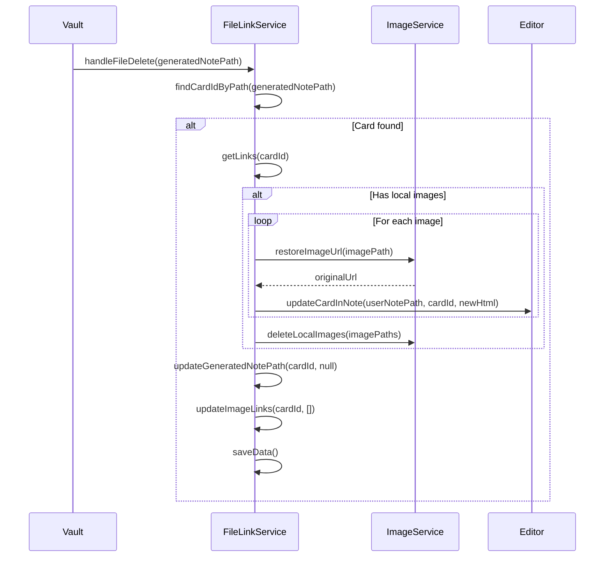
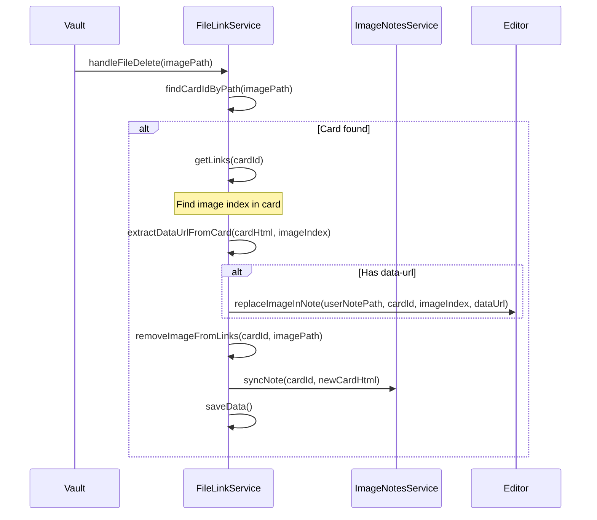
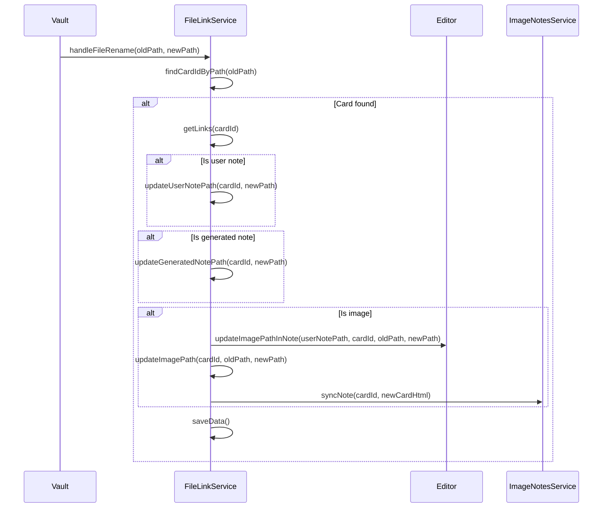

# Архитектура FileLinkService

## Обзор

`FileLinkService` — сервис для отслеживания связей между файлами в плагине obsidian-open-graph-card. Обеспечивает целостность данных при удалении и переименовании файлов.

## Структура данных

### Основная структура связей

```typescript
interface FileLinksData {
  // card-id → информация о связях
  [cardId: string]: CardLinks;
}

interface CardLinks {
  /** Путь к пользовательской заметке, содержащей карточку */
  userNotePath: string;
  
  /** Путь к сгенерированной заметке с ссылками на изображения */
  generatedNotePath: string | null;
  
  /** Множество путей к локальным изображениям карточки */
  imagePaths: string[];
}
```

### Обратные индексы для быстрого поиска

```typescript
interface FileLinkIndexes {
  /** Путь любого файла → card-id */
  pathToCardId: Map<string, string>;
  
  /** card-id → данные о связях */
  cardIdToLinks: Map<string, CardLinks>;
}
```

### Сериализация

Для сохранения в `data.json` используется преобразование:

```typescript
// Сохранение: Map → Record
function serialize(indexes: FileLinkIndexes): Record<string, CardLinks> {
  const result: Record<string, CardLinks> = {};
  for (const [cardId, links] of indexes.cardIdToLinks) {
    result[cardId] = links;
  }
  return result;
}

// Загрузка: Record → Map
function deserialize(data: Record<string, CardLinks>): FileLinkIndexes {
  const pathToCardId = new Map<string, string>();
  const cardIdToLinks = new Map<string, CardLinks>();
  
  for (const [cardId, links] of Object.entries(data)) {
    cardIdToLinks.set(cardId, links);
    
    // Строим обратный индекс
    pathToCardId.set(links.userNotePath, cardId);
    if (links.generatedNotePath) {
      pathToCardId.set(links.generatedNotePath, cardId);
    }
    for (const imagePath of links.imagePaths) {
      pathToCardId.set(imagePath, cardId);
    }
  }
  
  return { pathToCardId, cardIdToLinks };
}
```

## TypeScript интерфейсы

### Типы данных

```typescript
// src/types/links.ts

/** Связи карточки с файлами */
export interface CardLinks {
  userNotePath: string;
  generatedNotePath: string | null;
  imagePaths: string[];
}

/** Данные для сохранения в data.json */
export type FileLinksData = Record<string, CardLinks>;

/** Результат поиска связей */
export interface FileLinkSearchResult {
  cardId: string;
  links: CardLinks;
}

/** События плагина */
export interface FileLinkEvents {
  'og-card-created': { cardId: string; userNotePath: string };
  'og-card-deleted': { cardId: string };
  'og-card-images-downloaded': { cardId: string; imagePaths: string[] };
  'og-card-images-restored': { cardId: string };
}
```

### Интерфейс сервиса

```typescript
// src/services/FileLinkService.ts

export interface IFileLinkService {
  // === Управление связями ===
  
  /** Зарегистрировать новую карточку */
  registerCard(cardId: string, userNotePath: string): void;
  
  /** Удалить регистрацию карточки */
  unregisterCard(cardId: string): void;
  
  /** Обновить связи изображений карточки */
  updateImageLinks(cardId: string, imagePaths: string[]): void;
  
  /** Обновить путь к сгенерированной заметке */
  updateGeneratedNotePath(cardId: string, notePath: string | null): void;
  
  // === Поиск связей ===
  
  /** Найти card-id по пути файла */
  findCardIdByPath(path: string): string | null;
  
  /** Получить связи по card-id */
  getLinks(cardId: string): CardLinks | null;
  
  /** Получить все пути файлов для card-id */
  getAllPaths(cardId: string): string[];
  
  // === Обработка событий ===
  
  /** Обработать удаление файла */
  handleFileDelete(path: string): Promise<void>;
  
  /** Обработать переименование файла */
  handleFileRename(oldPath: string, newPath: string): Promise<void>;
  
  // === Персистентность ===
  
  /** Загрузить данные из data.json */
  loadData(): Promise<void>;
  
  /** Сохранить данные в data.json */
  saveData(): Promise<void>;
}
```

## Методы FileLinkService

### Основные методы

| Метод | Описание |
|-------|----------|
| `registerCard(cardId, userNotePath)` | Регистрирует новую карточку при её создании |
| `unregisterCard(cardId)` | Удаляет все связи карточки при её удалении |
| `updateImageLinks(cardId, imagePaths)` | Обновляет список путей к изображениям |
| `updateGeneratedNotePath(cardId, notePath)` | Обновляет путь к сгенерированной заметке |

### Методы поиска

| Метод | Описание |
|-------|----------|
| `findCardIdByPath(path)` | Находит card-id по любому связанному пути |
| `getLinks(cardId)` | Возвращает все связи карточки |
| `getAllPaths(cardId)` | Возвращает все пути файлов карточки |

### Методы обработки событий

| Метод | Описание |
|-------|----------|
| `handleFileDelete(path)` | Обрабатывает удаление файла через vault.on('delete') |
| `handleFileRename(oldPath, newPath)` | Обрабатывает переименование файла через vault.on('rename') |

## Диаграмма взаимодействия компонентов



## Потоки событий

### 1. Создание карточки



### 2. Скачивание изображений



### 3. Удаление пользовательской заметки



### 4. Удаление сгенерированной заметки



### 5. Удаление изображения



### 6. Переименование файла



## Интеграция с существующей архитектурой

### Изменения в PluginContext

```typescript
// src/core/PluginContext.ts
import { FileLinkService } from '../services/FileLinkService';

export class PluginContext {
    readonly fileLinkService: FileLinkService;
    
    constructor(app: App, getSettings: () => OpenGraphSettings, plugin: Plugin) {
        // ... existing services
        
        this.fileLinkService = new FileLinkService(app, plugin);
    }
}
```

### Изменения в main.ts

```typescript
// main.ts
export default class OpenGraphPlugin extends Plugin {
    async onload() {
        // ... existing initialization
        
        // Загружаем связи
        await this.context.fileLinkService.loadData();
        
        // Регистрируем обработчики событий
        this.registerEvent(
            this.app.vault.on('delete', (file) => {
                if (file instanceof TFile) {
                    this.context.fileLinkService.handleFileDelete(file.path);
                }
            })
        );
        
        this.registerEvent(
            this.app.vault.on('rename', (file, oldPath) => {
                if (file instanceof TFile) {
                    this.context.fileLinkService.handleFileRename(oldPath, file.path);
                }
            })
        );
    }
}
```

### Изменения в ContextMenuHandler

```typescript
// src/ui/ContextMenuHandler.ts
// При создании карточки:
this.context.fileLinkService.registerCard(cardId, notePath);

// При скачивании изображений:
this.context.fileLinkService.updateImageLinks(cardId, imagePaths);

// При удалении карточки:
this.context.fileLinkService.unregisterCard(cardId);
```

### Изменения в ImageNotesService

```typescript
// src/services/ImageNotesService.ts
// После создания/обновления заметки:
this.fileLinkService.updateGeneratedNotePath(cardId, notePath);

// После удаления заметки:
this.fileLinkService.updateGeneratedNotePath(cardId, null);
```

## Кастомные события

```typescript
// Определение событий
declare module 'obsidian' {
    interface Workspace {
        on(name: 'og-card-created', callback: (data: { cardId: string; userNotePath: string }) => void, ctx?: any): EventRef;
        on(name: 'og-card-deleted', callback: (data: { cardId: string }) => void, ctx?: any): EventRef;
        on(name: 'og-card-images-downloaded', callback: (data: { cardId: string; imagePaths: string[] }) => void, ctx?: any): EventRef;
        on(name: 'og-card-images-restored', callback: (data: { cardId: string }) => void, ctx?: any): EventRef;
    }
}

// Триггеры
this.app.workspace.trigger('og-card-created', { cardId, userNotePath });
this.app.workspace.trigger('og-card-deleted', { cardId });
this.app.workspace.trigger('og-card-images-downloaded', { cardId, imagePaths });
this.app.workspace.trigger('og-card-images-restored', { cardId });
```

## Обработка ошибок

```typescript
class FileLinkService {
    private async safeSaveData(): Promise<void> {
        try {
            await this.saveData();
        } catch (error) {
            console.error('FileLinkService: Failed to save data', error);
            // Не прерываем выполнение, данные можно восстановить
        }
    }
    
    private async safeDeleteFile(path: string): Promise<boolean> {
        try {
            const file = this.app.vault.getAbstractFileByPath(path);
            if (file instanceof TFile) {
                await this.app.vault.delete(file);
                return true;
            }
        } catch (error) {
            console.error(`FileLinkService: Failed to delete ${path}`, error);
        }
        return false;
    }
}
```

## Производительность

- **Обратный индекс** `pathToCardId` обеспечивает O(1) поиск card-id по пути
- **Сохранение данных** только при изменениях (не при каждом событии)
- **Batch операции** для массовых изменений (например, при удалении папки)

## Тестирование

Ключевые сценарии для тестирования:

1. Создание карточки → проверка регистрации связей
2. Скачивание изображений → проверка обновления путей
3. Удаление пользовательской заметки → проверка каскадного удаления
4. Удаление сгенерированной заметки → проверка восстановления URL
5. Удаление изображения → проверка обновления карточки
6. Переименование файлов → проверка обновления всех путей
7. Перезапуск плагина → проверка загрузки данных
